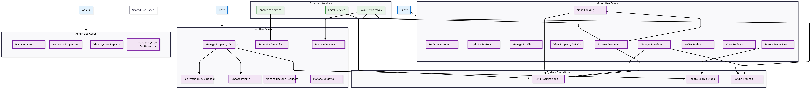

# Requirement Analysis

## Requirement Analysis in Software Development.
The Requirement Analysis Project focuses on crafting a comprehensive foundation for software development by documenting, analyzing, and structuring requirements. Through a series of well-defined tasks, learners will create a detailed blueprint of the requirement analysis phase for a booking management system. This project simulates a real-world development scenario, emphasizing clarity, precision, and structure in defining requirements to set the stage for successful project execution.

## What is Requirement Analysis?
Requirement Analysis is the systematic process of identifying, documenting, validating, and managing the needs and constraints that a software system must satisfy. It serves as the critical bridge between business objectives and technical implementation, transforming vague stakeholder needs into precise, actionable specifications.

In the software development lifecycle, a well-defined requirements ensure project success by aligning stakeholders, reducing ambiguity, and preventing costly rework.
They guide every phase—from planning and design to implementation, testing, and maintenance—by setting scope, specifications, and validation criteria.
Accurate requirements improve cost, schedule, and risk management while maintaining system quality.
Ultimately, they serve as the foundation for consistent understanding and long-term project sustainability.

# Acceptance Criteria

## Importance of Acceptance Criteria in Requirement Analysis

Acceptance Criteria are a fundamental component of requirement analysis that define the specific conditions that must be met for a software feature to be considered complete and acceptable by stakeholders. They serve as the critical bridge between high-level requirements and detailed, testable specifications.

### Key Importance

**1. Clear Definition of Done**
- Provides unambiguous conditions for when a feature is considered complete
- Eliminates ambiguity about what constitutes a working feature
- Sets concrete expectations for developers, testers, and stakeholders

**2. Prevents Scope Creep**
- Establishes clear boundaries for each feature
- Helps teams avoid gold-plating (adding unnecessary features)
- Provides a reference point when evaluating change requests

**3. Foundation for Testing**
- Serves as the basis for creating test cases
- Ensures comprehensive test coverage of all requirements
- Enables testers to verify feature functionality objectively

**4. Improved Communication**
- Creates a shared understanding among all team members
- Reduces misinterpretation between technical and non-technical stakeholders
- Facilitates better collaboration between development, QA, and product teams

**5. Quality Assurance**
- Ensures the delivered feature meets business and user needs
- Provides measurable standards for quality assessment
- Helps identify potential issues early in the development process

**6. User Story Completion**
- Completes user stories by adding specific, testable conditions
- Turns vague requirements into actionable development tasks
- Ensures each user story delivers actual value to end users

## Example: Acceptance Criteria for Checkout Feature

### Feature: Hotel Booking Checkout Process
**User Story:** As a guest, I want to complete my hotel booking quickly and securely so that I can confirm my reservation and receive booking confirmation.

### Use Case Diagrams

# Use Case Diagrams

## What are Use Case Diagrams?

Use Case Diagrams are a type of Unified Modeling Language (UML) diagram that visually represents the interactions between actors (users or external systems) and a system. They capture the functional requirements and scope of a system by showing the various ways users can interact with it to achieve specific goals.

### Key Components:

- **Actors:** Roles played by users or external systems that interact with the system
- **Use Cases:** Specific functionalities or features the system provides
- **Associations:** Lines connecting actors to use cases they participate in
- **System Boundary:** A box that defines the scope of the system being modeled

## Benefits of Use Case Diagrams

**1. Clear Requirement Visualization**
- Provides a high-level overview of system functionality
- Shows how different users interact with the system
- Helps stakeholders understand system scope without technical details

**2. Improved Communication**
- Serves as a common language between technical and non-technical stakeholders
- Facilitates discussions about system requirements and user interactions
- Helps identify missing requirements early in the development process

**3. Scope Management**
- Clearly defines system boundaries
- Helps prevent scope creep by establishing what's in and out of scope
- Identifies all user roles and their responsibilities

**4. Foundation for Development**
- Guides the creation of detailed use case specifications
- Informs database design and architecture decisions
- Helps identify necessary APIs and external integrations

**5. Testing Guidance**
- Provides basis for test case development
- Helps ensure all user interactions are tested
- Identifies different user scenarios that need validation

## Booking System Use Case Diagram

### Actors in the Booking System:

1. **Guest:** End user who searches for and books properties
2. **Host:** Property owner who manages listings and bookings
3. **Admin:** System administrator who manages users and content
4. **Payment Gateway:** External system that processes payments
5. **Email Service:** External system that handles notifications

### Use Cases:

**Guest-Related Use Cases:**
- Register Account
- Login to System
- Search Properties
- View Property Details
- Make Booking
- Manage Bookings (View/Cancel)
- Make Payment
- Write Review

**Host-Related Use Cases:**
- Register as Host
- Manage Property Listings
- Set Availability Calendar
- Manage Booking Requests
- Update Pricing
- View Performance Analytics
- Manage Payouts

**Admin-Related Use Cases:**
- Manage Users
- Moderate Properties
- View System Reports
- Manage System Configuration
- Handle Disputes

**System Use Cases:**
- Process Payment (with Payment Gateway)
- Send Notifications (with Email Service)
- Update Search Index
- Generate Reports

### Relationships:
- **Include Relationships:** Complex use cases that require other use cases
- **Extend Relationships:** Optional behaviors that extend base use cases
- **Generalization:** Specialized actors inheriting from more general ones

### Acceptance Criteria

**AC-1: Booking Summary Display**
- **Given** the user has selected a hotel room and dates
- **When** the user navigates to the checkout page
- **Then** the system shall display:
  - Hotel name, room type, and selected dates
  - Total number of nights
  - Base room rate per night
  - Itemized additional charges (taxes, service fees, cleaning fees)
  - Grand total amount in the selected currency
  - Cancellation policy summary

**AC-2: Guest Information Validation**
- **Given** the user is on the checkout page
- **When** the user enters guest information
- **Then** the system shall:
  - Require first name, last name, and email address
  - Validate email format (must contain @ and valid domain)
  - Make phone number optional but validate format if provided
  - Show real-time validation errors with clear messages
  - Prevent proceeding to payment with invalid information

**AC-3: Payment Method Processing**
- **Given** the user has entered valid guest information
- **When** the user selects a payment method
- **Then** the system shall:
  - Support credit/debit card payments (Visa, MasterCard, American Express)
  - Support at least one digital wallet (Google Pay, Apple Pay)
  - Display appropriate input fields for the selected payment method
  - Validate card number using Luhn algorithm
  - Validate expiration date (must be future date)
  - Validate CVV code (3-4 digits)
  - Mask sensitive payment information during input

**AC-4: Secure Payment Processing**
- **Given** the user has entered valid payment information
- **When** the user clicks "Complete Booking"
- **Then** the system shall:
  - Encrypt all payment data during transmission (TLS 1.3)
  - Process payment through the designated payment gateway
  - Handle payment failures gracefully with specific error messages
  - Show loading indicator during payment processing
  - Not store raw payment card data in system databases
  - Provide payment processing status updates

**AC-5: Booking Confirmation**
- **Given** the payment has been successfully processed
- **When** the booking is confirmed
- **Then** the system shall:
  - Generate a unique booking confirmation number
  - Display immediate on-screen confirmation with booking details
  - Send confirmation email within 5 minutes containing:
    - Booking confirmation number
    - Hotel details and check-in/check-out dates
    - Total amount charged
    - Cancellation policy details
    - Hotel contact information
  - Update room availability in real-time
  - Create booking record in the database with "confirmed" status

**AC-6: Error Handling and Edge Cases**
- **Given** various exceptional scenarios during checkout
- **When** errors occur
- **Then** the system shall:
  - Display "Room no longer available" if booking conflicts occur
  - Show "Payment declined" with retry option for failed payments
  - Handle session timeouts by preserving entered data where possible
  - Provide clear instructions for resolving common payment issues
  - Log all checkout failures for monitoring and analysis

**AC-7: Performance Requirements**
- **Given** normal system load conditions
- **When** users complete the checkout process
- **Then** the system shall:
  - Load the checkout page within 3 seconds
  - Process payments within 10 seconds
  - Send confirmation emails within 5 minutes
  - Support 100 concurrent checkout sessions during peak hours
  - Maintain data consistency throughout the booking process

**AC-8: Mobile Responsiveness**
- **Given** the user accesses checkout on a mobile device
- **When** completing the booking process
- **Then** the system shall:
  - Display all form fields and buttons appropriately on mobile screens
  - Support mobile-optimized payment methods (digital wallets)
  - Maintain functionality and usability on screens as small as 320px wide
  - Provide touch-friendly interface elements

### Verification Methods
Each acceptance criterion should be verified through:
- **Manual Testing:** QA team validates each scenario
- **Automated Testing:** Integration tests for payment processing
- **User Acceptance Testing:** Real users validate the complete flow
- **Performance Testing:** Load testing for concurrent checkouts
- **Security Testing:** Penetration testing for payment security

### Definition of Ready (DoR)
The checkout feature is ready for development when:
- All acceptance criteria are clearly defined and agreed upon
- UI/UX designs are finalized and approved
- Payment gateway integration specifications are documented
- API contracts for external services are defined

### Definition of Done (DoD)
The checkout feature is considered complete when:
- All acceptance criteria are met and verified
- Code has passed code review and quality gates
- All automated tests are passing
- Feature is deployed to staging environment
- UAT has been successfully completed
- Documentation has been updated
- Performance and security requirements are validated

## Why is Requirement Analysis Important?

1. It Establishes a Clear and Unambiguous Foundation, Preventing Scope Creep and Costly Rework
This is the primary defensive role of Requirement Analysis. Without a clear and agreed-upon set of requirements, a project is built on shifting sand. This phase forces the translation of vague ideas ("I want a user-friendly booking system") into precise, measurable, and testable specifications.

2. It Aligns All Stakeholders and Serves as a Single Source of Truth
A software project involves diverse stakeholders with different perspectives: business executives focus on ROI, end-users on usability, marketing on features, and developers on technical implementation. Requirement Analysis acts as the central communication hub that brings these groups into alignment.

3. It Drives the Entire SDLC and is the Basis for Planning, Design, and Testing
Requirement Analysis is not an isolated phase; its outputs are the fundamental inputs for every single subsequent phase of the SDLC. It is the blueprint from which the entire project is constructed.

## Key Activities in Requirement Analysis.

### 1. Requirement Gathering

This is the broad process of collecting all the necessary information and raw data about the system-to-be from various sources. It's often used interchangeably with "Elicitation," but gathering is the overarching activity of which elicitation is a part.

*   **Objective:** To collect a comprehensive set of raw needs, desires, and constraints from all relevant sources.
*   **Primary Focus:** **What** information is needed and **where** to find it.
*   **Key Activities:**
    *   Identifying and engaging all relevant **stakeholders** (clients, end-users, domain experts, project managers, etc.).
    *   Collecting existing documentation, such as business plans, manuals of old systems, policy documents, and regulatory standards.
    *   Distributing surveys and questionnaires to a large group of users to gather quantitative data on needs and problems.
    *   Conducting market and competitor analysis to understand industry standards and user expectations.
*   **Key Output:** A large, often unorganized, collection of raw data, notes, and documents that form the "ingredients" for the next stages.

***

### 2. Requirement Elicitation

This is the specific, interactive process of *drawing out* requirements from stakeholders. It involves using techniques to help stakeholders discover, articulate, and elaborate on their true needs, which they may not have fully formed or expressed clearly.

*   **Objective:** To uncover the underlying, often unstated, needs and constraints through direct interaction and collaboration.
*   **Primary Focus:** **How** to extract the true requirements from people.
*   **Key Techniques:**
    *   **Interviews:** One-on-one sessions to explore topics in depth with key individuals.
    *   **Workshops/Brainstorming Sessions:** Facilitated group meetings (e.g., JAD sessions) to encourage collaboration and build consensus.
    *   **Observation/Ethnography:** Watching users perform their jobs in their actual environment to understand workflow and identify unarticulated needs.
    *   **Prototyping:** Creating quick, early models of the system (wireframes, mockups) to visualize requirements and gather concrete feedback.
    *   **Focus Groups:** Moderated discussions with a group of users to get diverse perspectives on features and needs.
*   **Key Output:** Refined, clarified, and more detailed requirements ready for formal documentation.

***

### 3. Requirement Documentation

This activity involves formally recording the elicited requirements in a structured, clear, and consistent manner. The output serves as a single source of truth for the entire project.

*   **Objective:** To create a definitive, shared understanding of the system's capabilities and constraints for all stakeholders.
*   **Primary Focus:** **Recording** the requirements unambiguously.
*   **Key Artifacts:**
    *   **Software Requirements Specification (SRS):** A comprehensive formal document that describes both functional and non-functional requirements in detail.
    *   **User Stories:** Short, simple descriptions of a feature told from the perspective of the user (Common in Agile: "As a [type of user], I want [some goal] so that [some reason]").
    *   **Use Cases:** Detailed descriptions of how a user (actor) interacts with the system to achieve a specific goal, including the main flow and alternate flows.
    *   **Business Requirements Document (BRD):** A high-level document focusing on the business perspective, including objectives, scope, and success metrics.
*   **Key Characteristics of Good Documentation:**
    *   **Unambiguous:** Can only be interpreted one way.
    *   **Complete:** Contains all known requirements.
    *   **Consistent:** No conflicts between requirements.
    *   **Verifiable:** Can be tested (e.g., "The system must be fast" is not verifiable; "The system must respond in < 2 seconds" is).

***

### 4. Requirement Analysis and Modeling

This is the process of critically examining the documented requirements to identify problems, create models, and ensure they are of high quality before development begins.

*   **Objective:** To detect and resolve issues like conflicts, ambiguities, and gaps, and to structure the requirements for the development team.
*   **Primary Focus:** **Analyzing, refining, and structuring** the requirements.
*   **Key Activities:**
    *   **Classification:** Categorizing requirements (e.g., Functional, Non-functional, Business, User).
    *   **Prioritization:** Using techniques like **MoSCoW** (Must-have, Should-have, Could-have, Won't-have) to decide implementation order.
    *   **Conflict Resolution:** Identifying and mediating between contradictory requirements from different stakeholders.
    *   **Feasibility Analysis:** Checking if requirements are technically and financially achievable within project constraints.
    *   **Modeling:** Creating visual representations to clarify structure and behavior.
        *   **Data Flow Diagrams (DFDs):** Show how data moves through the system.
        *   **UML Diagrams:** Use Case Diagrams (who does what), Activity Diagrams (workflow), Sequence Diagrams (object interactions).
        *   **Entity-Relationship Diagrams (ERD):** Model the data structure.
*   **Key Output:** A refined, prioritized, and analyzed set of requirements, often accompanied by models, that is ready for validation.

***

### 5. Requirement Validation

This is the final check to ensure that the requirements document accurately reflects the stakeholders' needs and that the defined system is the one they actually want. It's about building the *right* system.

*   **Objective:** To obtain formal stakeholder confirmation that the requirements are correct, complete, and consistent.
*   **Primary Focus:** **Confirming correctness** with stakeholders.
*   **Key Techniques:**
    *   **Reviews & Inspections:** Formal meetings where the SRS is walked through line-by-line by stakeholders (developers, testers, clients, users) to find errors.
    *   **Prototype Walkthroughs:** Demonstrating an interactive prototype to stakeholders to validate that the look, feel, and flow meet their expectations.
    *   **Test Case Development:** Writing acceptance tests based on the requirements. If you cannot write a test for a requirement, it is not well-defined.
    *   **Creating a Traceability Matrix:** A table that links each requirement back to its origin (e.g., a business objective) and forward to its design and test elements. This ensures no requirement is missed or added without justification.
*   **Key Output:** A signed-off, validated requirements baseline that formally authorizes the development team to begin designing and building the system.

# Types of Requirements

## Functional Requirements

Functional requirements define the specific behaviors, functions, and features that the hotel booking system must perform. They describe what the system should do and how it should respond to specific inputs.

### Definition
Functional requirements specify the fundamental actions and operations that the system must be able to perform. They define the system's functionality from the user's perspective and represent the features that users expect to interact with directly.

### Examples for Hotel Booking Management System

**User Management Functions:**
- The system shall allow users to create accounts with email, password, and personal information
- The system shall enable users to log in using email/password authentication
- The system shall allow users to view and update their profile information
- The system shall provide password reset functionality via email verification

**Hotel Search and Discovery Functions:**
- The system shall allow customers to search hotels by location, date range, and number of guests
- The system shall display available hotels with prices, ratings, and basic amenities
- The system shall provide filter options for price range, star rating, amenities, and hotel type
- The system shall show real-time availability for selected dates
- The system shall display hotel recommendations based on user preferences and search history

**Booking Management Functions:**
- The system shall allow customers to select rooms and make reservations
- The system shall calculate total costs including taxes and service fees
- The system shall provide multiple payment options (credit card, digital wallets, etc.)
- The system shall send booking confirmation emails to customers
- The system shall allow customers to view their current and past bookings
- The system shall enable customers to cancel bookings according to cancellation policies

**Hotel Management Functions:**
- The system shall allow hotel managers to create and update hotel profiles
- The system shall enable managers to manage room inventory and pricing
- The system shall provide managers with booking dashboard and analytics
- The system shall allow managers to update room availability in real-time
- The system shall enable managers to respond to customer reviews and queries

**Payment Processing Functions:**
- The system shall integrate with third-party payment gateways
- The system shall process payments securely and provide payment receipts
- The system shall handle refunds according to cancellation policies
- The system shall manage payout processing to hotel partners

## Non-functional Requirements

Non-functional requirements define the quality attributes, performance standards, and constraints of the hotel booking system. They describe how the system should perform rather than what it should do.

### Definition
Non-functional requirements specify the criteria that judge the operation of the system rather than specific behaviors. They define the system's quality characteristics, including performance, security, reliability, and scalability.

### Examples for Hotel Booking Management System

**Performance Requirements:**
- The search functionality shall return results within 2 seconds for 95% of requests
- The system shall support 10,000 concurrent users during peak booking seasons
- The booking confirmation process shall complete within 5 seconds
- The system shall have 99.9% uptime during business hours
- Image loading for hotel galleries shall complete within 3 seconds

**Scalability Requirements:**
- The system shall scale horizontally to handle 100,000 daily active users
- The database architecture shall support master-slave replication for read-heavy operations
- The caching layer (Redis) shall reduce database load by 70% for frequently accessed data
- The CDN shall serve static content with global latency under 100ms
- The messaging queue shall handle 1 million messages per hour during peak loads

**Reliability and Availability Requirements:**
- The system shall maintain 99.95% annual uptime
- Database failover shall occur within 30 seconds of master failure
- The system shall have data backup and recovery procedures with RTO of 4 hours
- Payment transactions shall have 99.99% success rate during normal operations
- The system shall implement circuit breakers for third-party service failures

**Security Requirements:**
- All user data shall be encrypted in transit using TLS 1.3
- Passwords shall be stored using bcrypt hashing with salt
- Payment card data shall be processed in PCI DSS compliant manner
- The system shall prevent SQL injection and XSS attacks
- User sessions shall timeout after 30 minutes of inactivity
- API endpoints shall implement rate limiting (1000 requests/hour per user)

**Usability Requirements:**
- The mobile interface shall be responsive and work on devices with screen sizes from 320px to 1440px
- The booking process shall be completed in 5 steps or less
- The system shall support multiple languages and currencies
- Error messages shall be clear and suggest corrective actions
- The application shall achieve 85+ score in Lighthouse performance audit

**Maintainability Requirements:**
- The microservices architecture shall allow independent deployment of services
- The codebase shall have 80% test coverage for critical paths
- API documentation shall be automatically generated and kept updated
- Logging shall capture all critical business events for debugging
- The system shall support feature flags for gradual rollouts

**Data Management Requirements:**
- Recent booking data shall be available in Redis cache with 100ms response time
- Historical data shall be archived to Cassandra after 6 months
- Elasticsearch indices shall be updated within 5 seconds of data changes
- Data consistency between master and slave databases shall be maintained within 1 second
- Big data analytics shall process booking patterns using Hadoop/Spark infrastructure

**Integration Requirements:**
- Payment gateway integration shall support fallback mechanisms
- Email notifications shall be delivered within 1 minute of triggering events
- CDN shall synchronize new hotel images within 15 minutes of upload
- Kafka messaging shall ensure at-least-once delivery for critical booking events
- Third-party mapping services shall integrate for location-based searches
